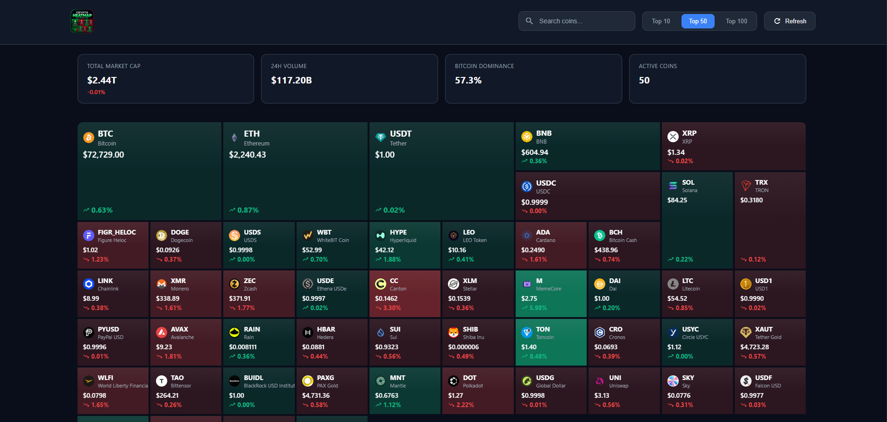
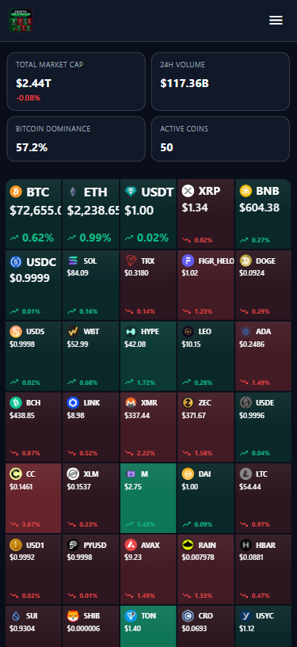
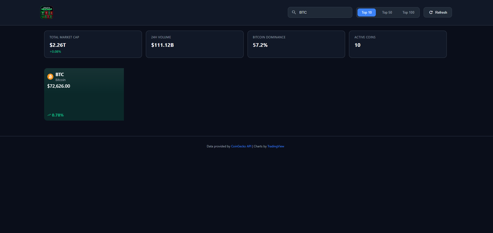
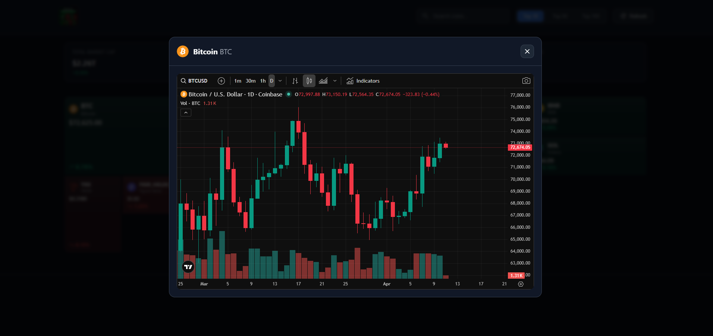
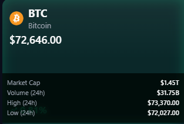

<p align="center">
  
</p>

<h1 align="center">🔥 Crypto Heatmap Dashboard 🔥</h1>

<p align="center">
  <strong>Real-time cryptocurrency market performance visualization with an interactive heatmap</strong>
</p>

<p align="center">
  <a href="#features">Features</a> •
  <a href="#demo">Demo</a> •
  <a href="#installation">Installation</a> •
  <a href="#usage">Usage</a> •
  <a href="#screenshots">Screenshots</a> •
  <a href="#license">License</a>
</p>

<p align="center">
  
  
  
  
  
</p>

---

## ✨ Features

### 🎯 Core Features
- **📊 Visual Heatmap** - Display cryptocurrencies as blocks proportional to their market cap
- **🎨 Dynamic Coloring** - Green/Red based on 24h performance, intensity based on % change
- **🔍 Real-time Search** - Filter coins by name or symbol instantly
- **📈 TradingView Charts** - Click any coin to view its advanced chart
- **⚡ Real-time Data** - CoinGecko API for the most recent market data

### 🎛️ Controls
| Function | Description |
|----------|-------------|
| **Top 10/50/100** | Toggle between top cryptos by market cap |
| **🔎 Search** | Search by name (Bitcoin) or symbol (BTC) |
| **🔄 Refresh** | Manually refresh the data |
| **💡 Hover** | Hover to see market cap, volume, 24h high/low |
| **🖱️ Click** | Open the modal with TradingView chart |

### 🌟 Extras
- 🌙 **Dark Mode** by default (pro trading design)
- 📱 **Responsive** - Desktop, tablet, mobile
- 💾 **LocalStorage** - Save your preferences (top 10/50/100)
- 🎬 **Animations** - Smooth transitions on hover and load
- 🖥️ **Console Style** - Styled welcome message in the console
- 🚀 **Zero Framework** - 100% Vanilla JS, no dependencies

---

## 🎮 Demo

> **🌐 Live Demo :** [https://kirobotdev.github.io/Heatmap-Dashboard](https://kirobotdev.github.io/Heatmap-Dashboard)

### 🔧 Local Development
```bash
# Clone the repo
git clone https://github.com/KirobotDev/Heatmap-Dashboard.git

# Navigate to folder
cd crypto-heatmap

# Open with Live Server (VS Code) or open index.html directly
code .
# Then right-click → "Open with Live Server"
```

**Note on CORS:** CoinGecko API may block requests from `localhost` after a certain number of requests. If you see CORS errors:
1. Wait a few minutes (rate limit)
2. Use a CORS Unblock extension temporarily
3. Deploy to Netlify/Vercel for a real domain

---

## 📸 Screenshots

### 🖥️ Desktop View

*Main view with top 50 cryptos heatmap*

### 📱 Mobile View
<p align="center">
  
</p>
*Responsive design adapted for mobile*

### 🔍 Search & Filters

*Real-time search and Top 10/50/100 filters*

### 📈 TradingView Modal

*Advanced chart opens on coin click*

### ✨ Hover Effects

*Additional details on hover*

---

## 🛠️ Technologies

### 🎨 Frontend
- **HTML5** - Semantic structure
- **CSS3** - Grid, Flexbox, CSS Variables, Animations
- **Vanilla JavaScript** - ES6+, Fetch API, DOM Manipulation

### 🔌 APIs
- **[CoinGecko API](https://www.coingecko.com/en/api)** - Crypto market data
  - `/coins/markets` - Prices, market cap, volume
  - `/global` - Global market stats
- **[TradingView Widget](https://www.tradingview.com/widget/)** - Advanced charts

### 🎁 Resources
- [Google Material Icons](https://fonts.google.com/icons) - Vector icons
- TradingView Advanced Chart Widget

---

## 📁 Project Structure

```
crypto-heatmap/
├── index.html          # Complete application (HTML + CSS + JS)
├── README.md           # Documentation
├── LICENSE             # MIT License
└── screenshots/        # Screenshots (to add)
    ├── desktop-view.png
    ├── mobile-view.png
    ├── search-feature.png
    ├── tradingview-modal.png
    └── hover-effects.png
```

> **💡 Note:** The entire application is contained in a single `index.html` file for easy deployment.

---

## 🚀 Deployment

### 🌟 Netlify (Recommended)
1. Go to [netlify.com](https://netlify.com)
2. Drag & drop your `crypto-heatmap` folder
3. Your site is live! 🎉

### ▲ Vercel
```bash
npm i -g vercel
vercel
```

### 📦 GitHub Pages
1. Push to GitHub
2. Settings → Pages → Source: Deploy from a branch → main / root
3. Your site will be at `https://kirobotdev.github.io/Heatmap-Dashboard`

---

## ⚙️ Configuration

### 🔧 Configuration Variables
In `index.html`, modify the `CONFIG` section:

```javascript
const CONFIG = {
    API_URL: 'https://api.coingecko.com/api/v3',
    DEFAULT_LIMIT: 50,        // Number of coins displayed by default (10, 50, 100)
    REFRESH_INTERVAL: 60000,  // Auto-refresh interval in ms (1 min = 60000)
    STORAGE_KEY: 'cryptoHeatmapPrefs'
};
```

### 🎨 Color Customization
Modify the CSS `:root` variables:

```css
:root {
    --bg-primary: #0a0e1a;     /* Main background */
    --bg-secondary: #111827;  /* Header, cards */
    --accent-green: #10b981;  /* Gains/positive */
    --accent-red: #ef4444;    /* Losses/negative */
    --accent-blue: #3b82f6;   /* Buttons, links */
}
```

---

## 📝 API Reference

### Used Endpoints

| Endpoint | Description |
|----------|-------------|
| `GET /coins/markets` | Coin data (prices, market cap, 24h change) |
| `GET /global` | Global stats (total market cap, BTC dominance) |

### CoinGecko Parameters
```
vs_currency=usd          # Currency
order=market_cap_desc    # Sort by market cap
per_page=50              # Limit (10, 50, or 100)
page=1                   # First page
price_change_percentage=24h  # 24h change
```

---

## 🤝 Contributing

Contributions are welcome! 🙌

### 🐛 Reporting a Bug
1. Open an [Issue](https://github.com/KirobotDev/Heatmap-Dashboard/issues)
2. Describe the bug with steps to reproduce
3. Add screenshots if possible

### 💡 Proposing an Improvement
1. Fork the project
2. Create a branch (`git checkout -b feature/my-feature`)
3. Commit (`git commit -m 'Add my feature'`)
4. Push (`git push origin feature/my-feature`)
5. Open a Pull Request

### 🎯 Roadmap
- [ ] Light mode
- [ ] Personal watchlist
- [ ] Price alerts
- [ ] More timeframes (7d, 30d, 1y)
- [ ] Multi-currency (EUR, GBP, JPY)

---

## 👨‍💻 Author

**xql.dev**
- GitHub: [@KirobotDev](https://github.com/KirobotDev)

---

## 🙏 Acknowledgments

- [CoinGecko](https://www.coingecko.com) for their free API
- [TradingView](https://www.tradingview.com) for the charts
- [Google Fonts](https://fonts.google.com) for Material Icons

---

## 📜 License

This project is under the **MIT** License - see the [LICENSE](LICENSE) file for details.

```
MIT License

Copyright (c) 2026 xql.dev

Permission is hereby granted, free of charge, to any person obtaining a copy
of this software and associated documentation files (the "Software"), to deal
in the Software without restriction, including without limitation the rights
to use, copy, modify, merge, publish, distribute, sublicense, and/or sell
copies of the Software, and to permit persons to whom the Software is
furnished to do so, subject to the following conditions:

The above copyright notice and this permission notice shall be included in all
copies or substantial portions of the Software.

THE SOFTWARE IS PROVIDED "AS IS", WITHOUT WARRANTY OF ANY KIND, EXPRESS OR
IMPLIED, INCLUDING BUT NOT LIMITED TO THE WARRANTIES OF MERCHANTABILITY,
FITNESS FOR A PARTICULAR PURPOSE AND NONINFRINGEMENT. IN NO EVENT SHALL THE
AUTHORS OR COPYRIGHT HOLDERS BE LIABLE FOR ANY CLAIM, DAMAGES OR OTHER
LIABILITY, WHETHER IN AN ACTION OF CONTRACT, TORT OR OTHERWISE, ARISING FROM,
OUT OF OR IN CONNECTION WITH THE SOFTWARE OR THE USE OR OTHER DEALINGS IN THE
SOFTWARE.
```

---

<p align="center">
  ⭐ Star this repo if you like it! ⭐
</p>

<p align="center">
  <strong>Made with xql.dev & the Community for crypto traders</strong>
</p>
